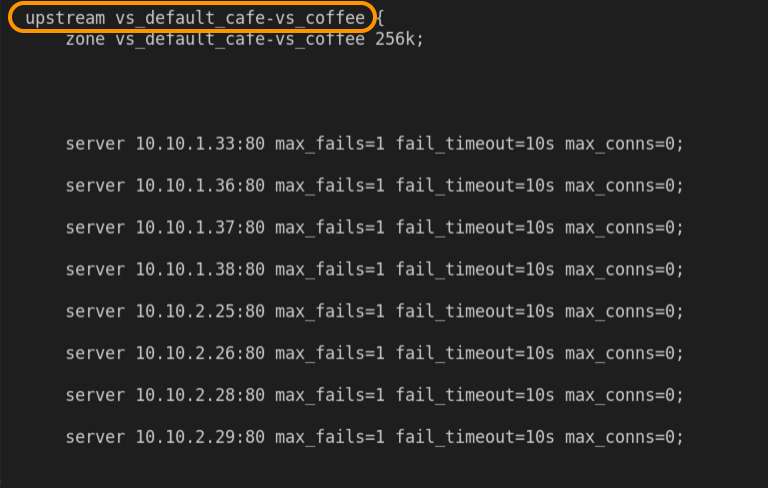
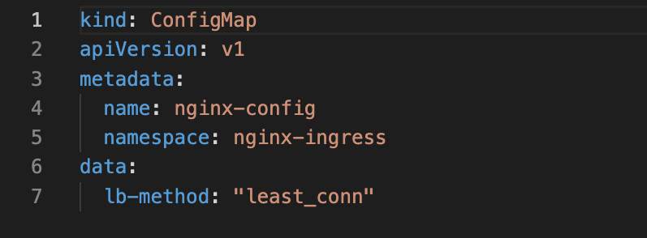
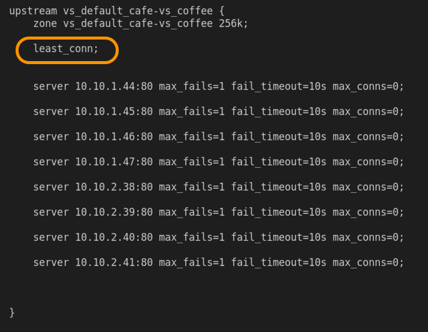
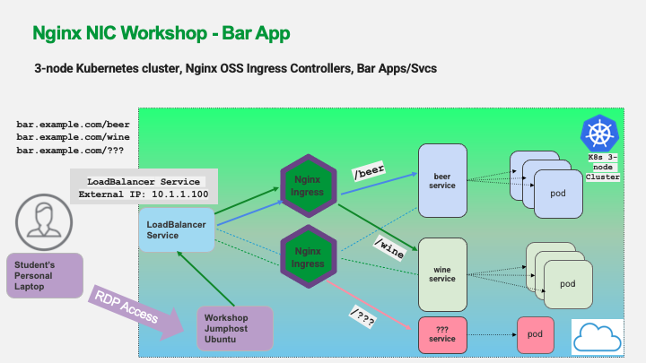
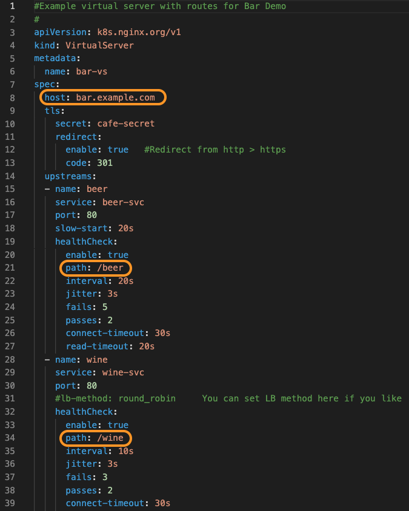

## Lab 6: HTTP Load Testing and Cafe Scaling

## Introduction

In this lab, you will send some HTTP traffic to your Ingress Controller and Cafe Application, and watch NGINX Ingress load balance the trafffic.  You will scale the application pods and Ingress Controller up and down, and watch what happens in realtime.

<br/>

## Learning Objectives

- HTTP Traffic Generation
- Scale Cafe Applications
- Optional Exercises
- Host-based Routing
- Observe NGINX Dashboard

<br/>

## HTTP Traffic Generation

We will use a tool called [`wrk` ](https://github.com/wg/wrk), running in a Docker container, to generate traffic to your Ingress Controller.

1. Open a Terminal from the Ubuntu Desktop

    

1. In the terminal window, run this command to start the load generation using `wrk` inside a docker container:

    ```bash
    docker run --rm williamyeh/wrk -t4 -c200 -d20m -H 'Host: cafe.example.com' --timeout 2s https://10.1.1.100/coffee
    ```

    

    This will run the `wrk` load tool for **20 minutes**, with **200 connections**.  You can run this command again if you need additional time.

1. Observe your NGINX Dashboard - http://dashboard.example.com/stub_status.html

    

    **Questions:**

     - Do you see the number of HTTP requests increasing? 

        <details><summary>Click for Hints!</summary>
        <br/>
        <p>
        <Strong>Hints:</Strong> Look at the "server" line, there you will find the total requests counter. 
        </p>
        </details><br/>

## Scale Applications

Coffee Break Time!! Let's scale the Coffee `Deployment`. In anticipation of a surge in coffee drinkers - The boss says we need more Keurig pods.

1. While watching the Dashboard, change the number (`replicas`) of Coffee pods from `three`, to a total of `eight`:

    ```bash
    kubectl scale deployment coffee --replicas=8
    ```
    

    **Question:** How long does it take Kubernetes to add the new pods?  

    **Answer:** NGINX Ingress will begin routing traffic to the `five` additional pods as soon as the K8s live-readiness probes are successful. 

1. Check to see if all 8 of the Coffee pods are running:

   ```bash
    kubectl describe deployment coffee
    ```

    

1. Verify NGINX Ingress is now configured to send traffic to all 8 pods. Find the `vs_default_cafe-vs_coffee` upstream block, and see if there are 8 server IP address:80 entries:

    ```bash
    kubectl exec -it $NIC -n nginx-ingress -- /bin/bash -c "nginx -T"
    ```

    
    
1. Check to see if you now get 8 different IP address when accessing Coffee.  Use curl to request the coffee page, and grep for the Server Address field in the response, like so:

   ```bash
   while true; do curl -k https://cafe.example.com/coffee |grep "Server Address"; sleep 1; done
   ```

   You should see 8 different IPs. Type `Control-C` to stop the curl command.

1. Let's configure NGINX Ingress Controller to use the Load Balancing algorithm called `Least Connections` so that the most responsive (faster) pods are preferred for more TCP Connections and HTTP Requests. 

   Inspect the `lab6/nginx-config-leastconn.yaml` manifest. This is the Nginx **ConfigMap** for the Ingress Controller that configures it to use a different algorithm.  
   
   
   
   Apply the manifest:

    ```bash
    kubectl apply -f lab6/nginx-config-leastconn.yaml
    ```

   Verify NGINX Ingress is now configured for Least Connections.  Once again, find the `vs_default_cafe-vs_coffee` upstream block, and see if the `least_conn directive` is there:

    ```bash
    kubectl exec -it $NIC -n nginx-ingress -- /bin/bash -c "nginx -T"
    ```

   


    - **Question:** Why are some pods faster or slower than others?
    <details>
      <summary>Click for Hints!</summary>
      <br/>
      <p>
        <strong>Answer:</strong>  </br></br> Some pods are slower than others, because there are other workloads running in the cluster, and you don't control where and when those other workloads are deployed, or how many resources they will consume among the pods.</br></br>This means not all pods have equal resources, and are not equal in performance, leading to an imbalance of Response Times. <br/></br>Some users will connect to a fast pod, some will get stuck with a slow pod.
      </p>
    </details><br/>

1.  In today's Modern Application production workloads, it is important to send customers' requests to the most reliable and performant `pod`.  NGINX's `Least-Conn` Load Balancing algorithm allows you to handle more total requests, and it adjusts automatically as pod performance and conditions in the Kubernetes cluster change minute by minute.

    **This should provide a better customer experience, essential for today's modern applications.** 
 
1. Boss says Coffee rush is now over, so scale back the number of coffee pods to `three`. Run the following `kubectl scale ` command:

    ```bash
    kubectl scale deployment coffee --replicas=3
    ```

    Did you notice any errors in the NGINX Dashboard while Kubernetes scaled down the pods? 

    When scaling down, NGINX will try to complete requests before Kubernetes terminates a running `pod`, after all the responses in flight have finished processing on that `pod`, so there should not be any errors. 

    Did you notice any errors when you asked NGINX to change its load balancing algorithm from round-robin to `Least-Conn`? There should not have been any errors. The Configuration Reload should allows existing connections to finish their work, while allowing new connections to use the new configuration. 
    
<br/>

### Optional Lab Exercise1: 

Try the same scale up, then scale down commands for the Cafe **Tea** `Deployment`. Does NGINX also send more traffic to the faster Tea pods? Set the tea pods back to **three** replicas when you are finished.

**Note:**  You will have to target `/tea` with the `wrk` tool if you want to load test Tea:

1. Run the following command to apply load to the Tea Service for 10 minutes:

    ```bash
    docker run --rm williamyeh/wrk -t4 -c200 -d10m -H 'Host: cafe.example.com' --timeout 2s https://10.1.1.100/tea
    ```

<br/>

### Optional Lab Exercise2: 

1. You can change the load balancing algorithm back to round-robin if you like, and check out the differences. Apply the following manifest to make that change:

    ```bash
    kubectl apply -f lab6/nginx-config-roundrobin.yaml
    ```
<br/>

<br/>

## Host Based Routing

**New business opportunity!!** The boss got a business loan to open the Cafe as a Bar in the evenings for `beer and wine tasting! ` So you need to add Beer and Wine applications, and expose these using the NGINX Ingress Controller. 

**Hurry up - it's almost Happy Hour!**

See the logical diagram of the new **beer** and **wine** applications:



1. In the `lab6` folder, inspect the `bar.yaml` and `bar-virtualserver.yaml` manifest files. You will see that we are adding the required  `Deployment` and `Service`, and exposing them with `VirtualServer`, using a new hostname, `bar.example.com.`

    

1. Create the **beer** and **wine** ` Deployment` and `Service`, by applying the provided manifests. 
   
    ```bash
    kubectl apply -f lab6/bar.yaml
    ```

1. Create a new `VirtualServer` listening on the hostname, **`bar.example.com`**, with `/beer` and `/wine` URI paths to the new application deployments, by applying the `bar-virtualserver.yaml` file:

   ```bash
   kubectl apply -f lab6/bar-virtualserver.yaml
   ```

1. Verify the new bar VirtualServer configuration was accepted by the Ingress Controller, the STATE should be `Valid` :

   ```bash
   kubectl get vs
   ```

   

   > Note:  If your VirtualServer shows a STATE of `Invalid`, there is an issue with the manifest file!  This a good troubleshooting tip, the VS CRD gives clear messages about why the configuration is Invalid, as shown in this example:

   ```bash
   kubectl describe vs bar-vs
   ```

   

   In this example, the upstream "slow-start" option was enabled, which is an NGINX Plus only feature.

1. Open two new Chrome web browser windows and browse to https://bar.example.com/beer and https://bar.example.com/wine.  
   
   **Note:** You can once again safely proceed to this insecure site.

   Do the new `beer` and `wine` applications load as expected?

   

1. Observe your NIC Dashboard again on http://dashboard.example.com/stub_status.html

    **Question:**

    - What does the Dashboard show you when you refresh `/beer` and `/wine` multiple times?  
    
      The Requests counter should increase, as this Bar traffic is also going through your Ingress Controller.  

    You can see how easy it is to add a new `Deployment` and `Service`, and then configure NGINX Ingress Controller with CRDs to create a new HTTP Hostname, URI paths and route traffic to these new Services and have External access to these applications immediately. The NGINX `VirtualServer` CRD's allow you to easily add new hosts and services.

    This ability of self-service Host and Path based HTTP routing makes it easy to add and deploy new services, and NGINX Ingress routes the traffic correctly (and BTW - you didn't have to submit even one Ticket to IT and WAIT !!). 
    
    As you can see, this enables application/development teams to rapidly build, deploy, and expose new modern apps for the business, without waiting for lengthy deployment/approval processes.

**Bonus:** `Sneaky Pete!`  There was one additional `Happy Hour Drink Special` cocktail added by the boss's daughter.  Did you find it? 

  <details>
    <summary>Click for Answer!</summary>
    <br/>
    <p>
      <strong>Answer:</strong> In case you did'nt find it, the boss's daughter added <code>/cosmo</code> to the beer and wine VS manifests!  Does <code>https://bar.example.com/cosmo</code> work as intended ?
    </p>
  </details><br/>

You should also notice that Cafe is still running as before, adding the Bar services and VirtualServer definitions had no impact.

**This completes this Lab.**

<br/>

## References: 
- [Wrk Tool](https://github.com/wg/wrk)
- [Least_conn Algorithm](http://nginx.org/en/docs/http/ngx_http_upstream_module.html#least_conn)
- [VirtualServer CRDs](https://docs.nginx.com/nginx-ingress-controller/configuration/virtualserver-and-virtualserverroute-resources/)
- [Compare NGINX and NGINX Plus](https://www.nginx.com/products/nginx/compare-models)

### Authors
- Chris Akker - Solutions Architect - Community and Alliances @ F5, Inc.
- Shouvik Dutta - Technical Solutions Architect @ F5, Inc.

-------------

Navigate to ([Lab7](../lab7/readme.md) | [Main Menu](../LabGuide.md))
