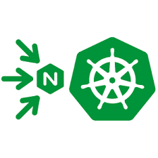

# NGINX Ingress Controller Workshop

 

## Welcome!

 

> ><strong>Welcome to the NGINX OSS Workshop for NGINX Ingress Controller (NIC)!</strong>

 

This Workshop will introduce NGINX OSS Ingress Controller with hands-on practice through self-paced lab exercises.

You will learn how to configure an **`NGINX OSS Ingress Controller`**, deploy it on a Kubernetes cluster, configure basic and advanced NGINX features, loadtest it, scale it up and down and monitor it in realtime.  You will deploy new apps and services in your private cluster, terminate SSL, route HTTP traffic, configure redirects, sorry pages, and load balance traffic to running pods.

 

But Wait - I'm already running NGINX, aren't I ?  NGINX OSS Ingress is not the default Ingress, the Community Ingress is the default.

Here is a side by side comparison for NGINX Ingress vs Community Ingress:

 

NGINX Version  |  K8s Community Version
:-------------------------:|:-------------------------:
nginxinc/kubernetes-ingress | kubernetes/ingress-nginx
NGINX Open Source | Kubernetes Open Source
Written in "C" | Custom NGINX Build with LUA
Small Footprint | Large Footprint
Extended with CRDs | Limited to Ingress Type
NGINX Support | Community Support
Commercial Option available | No Commercial Option
  |  

 

For further details, read the blogs on Nginx.com:

- https://www.nginx.com/blog/guide-to-choosing-ingress-controller-part-3-open-source-default-commercial/

- https://www.nginx.com/blog/guide-to-choosing-ingress-controller-part-4-nginx-ingress-controller-options

 

These Hands-On Lab Exercises are designed to build upon each other, adding additional services and features as you progress through them, completing the labs in sequential order is required. 

By the end of this Workshop, you will have a working, operational NGINX Ingress Controller, routing traffic to and from Kubernetes application pods and services, with the necessary skills to deploy and operate NIC for your own Digital Enterprise Applications running in Kubernetes.  Thank You for taking the time to attend this NGINX Workshop!

## About NGINX Ingress Controller

NGINX Ingress Controller is an Open Source resource for directing traffic to/from a Kubernetes Cluster.  NGINX runs all popular K8s platformss, including Amazon EKS, Google GKE, Redhat Openshift, Azure AKS and many others.  It can also work with your on-premise Data Center based K8s clusters.  NGINX Ingress Controller is built from the same source code you know and trust from NGINX.  You can find the full Kubernetes support matrix and technical specifications for NGINX Ingress Controller on the http://www.nginx.org website.  

 

 

NGINX Ingress Controller has the best-in-class traffic management solution for cloud‑native apps in Kubernetes and containerized environments. In a recent 
[CNCF](https://www.cncf.io/blog/2018/08/29/cncf-survey-use-of-cloud-native-technologies-in-production-has-grown-over-200-percent/)
survey, nearly two‑thirds of respondents reported using the NGINX Ingress Controller, more than all other controllers combined – and NGINX Ingress Controller has been downloaded more than [10 million
times](https://hub.docker.com/r/nginx/nginx-ingress) on DockerHub. 

 

 

Combining the speed and performance of NGINX with the trust and security behind F5 Networks, NGINX Ingress Controller is synonymous with high‑performance, scalable, and secure modern apps in development, testing, QA, and staging.

https://docs.nginx.com/nginx-ingress-controller/intro/how-nginx-ingress-controller-works/

https://docs.nginx.com/nginx-ingress-controller/technical-specifications/

 

### Authors

- Chris Akker - Solutions Architect - Community and Alliances @ F5, Inc.
- Shouvik Dutta - Solutions Architect - Sales @ F5, Inc.
- Jason Williams - Principle Product Management Engineer @ F5, Inc.

-------------

This completes the Introduction.
  
Click on ([LabGuide](LabGuide.md)) to begin the workshop.
