## Lab 10: Advanced Nginx Plus features with VirtualServer manifests

## Learning Objectives 

By the end of the lab, you will be able to: 

* Enable and test some Nginx Plus features to control how Ingress Controller handles different situations and enables Enterprise features, like:
    - Active Healthchecks
    - Custom Error Pages
    - HTTP Caching
    - Mutual TLS
    - Blue/Green testing

<br/>

### Active Healthchecks

<br/>


<br/>

Nginx Plus provides many options for active health checking of pods and services.  You will enable some checks for URI paths, and set the interval and counts that meet the needs of the application.  A Community Ingress manifest has some limitations in defining a healthcheck. With an Nginx VirtualServer manifest, additional options can be configured for production workloads. 

1. Inspect `lab10/juice-health-bad-vs.yaml` file, lines 17-25 for the healthchecks.  You will notice we have commented out the correct TCP port for the healthcheck of the backend pods.  What do you think will happen if you do not check the correct TCP port?

    

1. Remove the running JuiceShop Virtual Server from the previous lab:

    ```bash
    kubectl delete -f lab9/juiceshop-vs.yaml
    ```

1. Try the new Virtual Server with incorrect healthchecks enabled:

    ```bash
    kubectl apply -f lab10/juice-health-bad-vs.yaml
    ```

1. Check your Plus Dashboard, and then try refreshing your Juice Shop browser page.  What did you see and what happened to your JuiceShop application ?

    <details>
      <summary>Click for Hints!</summary>
      <br/>
      <p>
        Yikes - Your website is DOWN hard!  Customers are getting a 502 Bad Gateway error. 
      </p>
    </details><br/>

     

     

1. Quickly!! - checking further, look at the Ingress Controller logs, what do they show ?

    ```bash
    kubectl logs -n nginx-ingress $KIC_POD_NAME --follow --tail=20
    ```

    **Detailed Explanation:**  The Dashboard shows all your juiceshop upstreams as Down, due to `Failed` healthchecks.  Your JuiceShop VirtualServer is running, but the website is now offline because the pods are in a `Failed` state.  Nginx `502 Bad Gateway` errors are an important sign that Nginx has `no upstreams available` to service the request.

    The Ingress Logs should show `[error] 97 ... 111: Connection refused` messages for the healthchecks on port 80 (but remember, the JuiceShop pods are running on port 3000!).

     

    Type Ctrl+C to stop the log tail when you are finished.

1. Inspect the fixed YAML manifest VS file, `juice-health-good-vs.yaml`, with the correct healthcheck port of 3000 on line #24. Now try that one:

    ```bash
    kubectl apply -f lab10/juice-health-good-vs.yaml
    ```

1. Check your KIC Plus Dashboard again, with Health monitors now green, and your website is up and browser access is restored.  The connection errors in the Ingress log should have stopped as well.

     

<br/>

### Custom Error Pages

<br/>


The Director of Customer Support has asked if you can stop the ugly HTTP 502 error messages from going back to the customers, as the developers say they are too busy to fix it. While you can't actually stop them, you can hide the 502 errors and send the customers an alternative page. 

So you will enable a `Sorry page` that gives customers a more friendly `Please try again later` message, with a Customer Support phone number to call if they need help.

Nginx Plus provides many options for intercepting HTTP response errors and providing user-friendly error pages from web applications.  In this example, you will enable a simple error response page.

1. Inspect `lab10/juice-sorrypage.yaml` file, lines 30-40.  
    

    Now apply the customer friendly error page manifest:

    ```bash
    kubectl apply -f lab10/juice-sorrypage.yaml
    ```

1. And try a refresh on your Juice Shop Browser, what do you see now ? 

    

    Notice we have modified this 502 Bad Gateway error page to be more customer friendly.  For production, you could further customize this page if a user encountered an error page from a pod.  If you check Chrome Developer Tools, you will see that we have also added a custom `Nginx Debug Header`, which shows what the original response error code was.

    

    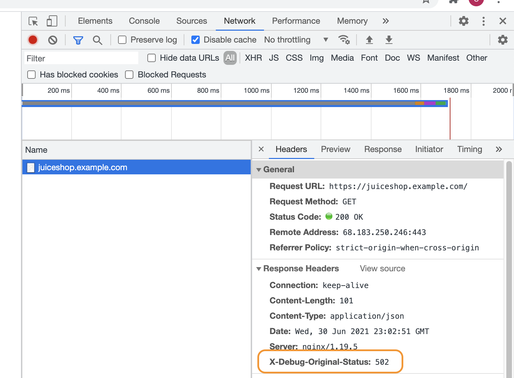

    Leave the Chrome Developer Tools open, you will need it for the next section.

    <br/>

### Nginx Caching

<br/>


<br/>

Next, you will use some of the extra RAM available in your Ingress Controller to provide caching of static images from the pods.  This will `improve` the customer experience by delivering images from the KIC's RAM, instead of waiting for the pods to deliver them.  

In the previous Enhanced Logging lab, you added the `cache status` variable - `$upstream_cache_status` - to the Nginx access log, so you can see the cache HITS, MISSES, and EXPIRED status in the access log. You will also insert a custom HTTP Header for X-Cache-Status, so we can see the Nginx cache Response Header values with Chrome Developer Tools.

Inspect `lab10/juice-cache-vs.yaml` file, lines 7-9.  Notice you are using an `http-snippet` to customize Nginx to use 256MB of available RAM for the cache, and to add an Nginx `X-Cache-Status` HTTP response header.  And, on lines 32-36, you are also using a `location-snippet` to further customize Nginx to cache 200 responses for 30 seconds (cache aging timer), and ignore any Cache-Control request headers.  

| HTTP Snippet | Location Snippet |
|--------------|------------------|
|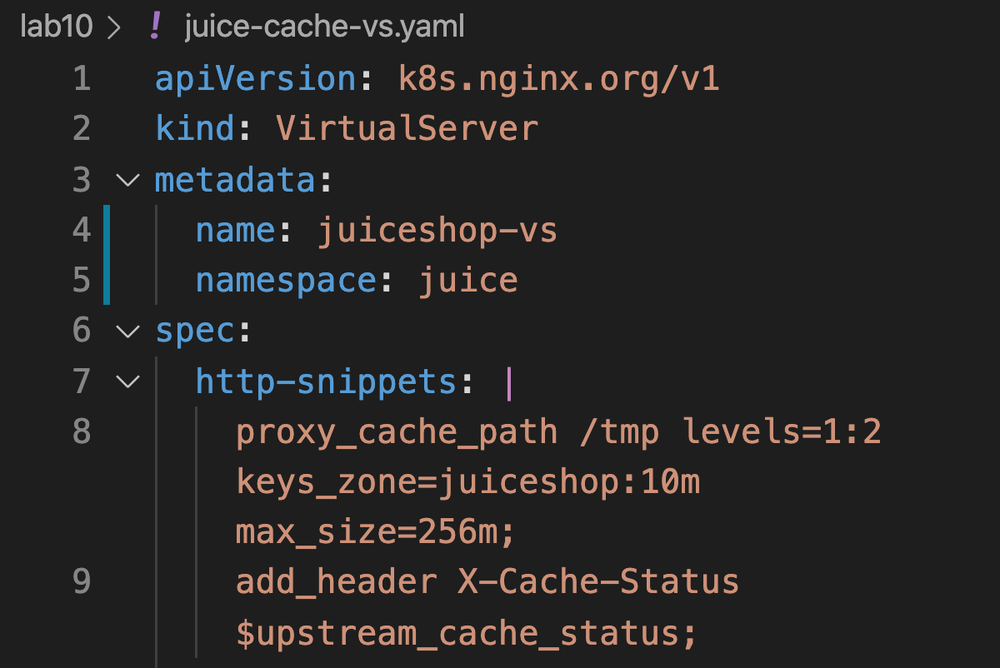|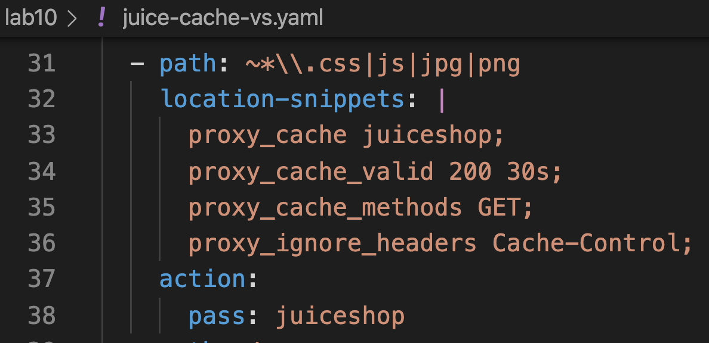 |

**Note:** In production, you would like to set the cache aging timer higher than 30 seconds. We intentionaly set the timer low in this lab so you can see what happens when the cache timer expires.

1.  Now apply this Caching configuration, and test it:

    ```bash
    kubectl apply -f lab10/juice-cache-vs.yaml
    ```

    Monitor the Ingress Controller access log, watch for "HIT", "MISS", and "EXPIRED" entries, while you refresh the Juice Shop pages:

    ```bash
    kubectl logs -n nginx-ingress $KIC_POD_NAME --follow --tail 50
    ```

    During refreshes, you should see some Cache "MISS" and "HIT" and "EXPIRED" log entries, it should be the last field of each log entry in the access log, as shown below.  (This `Cache Status logging variable` was added when you enabled Enhanced Logging in a previous exercise).

    

    

    

    Type Ctrl+C to stop the log tail when you are finished.
    
1. Now, open a new Tab in Chrome, enable Developer Tools, and make sure you disable Chrome's internal browser cache, and select the `Network` tab at the top in Chrome Tools.  Click the JuiceShop Favorite.

    Look for the `X-Cache-Status` Response Header and value (that Ingress is adding).  It should look like this:

    

1. **Deep Dive** - As an example, if you click on the first image in the Name list, `apple_juice.jpg`, you should see an HTTP Response Header X-Cache-Status = MISS.  If you refresh a couple times, and check again, it should now show X-Cache-Status = HIT.  If you wait more than 30 seconds, and refresh again, it should show X-Cache-Status = EXPIRED. 

    **Explanation:**  the first request will be a cache MISS, because Nginx does not have a copy of this object in the Cache, and it must be served from the Upstream origin pod.  After the first request, it will be a Cache HIT because Nginx is caching it and served it from its Cache.  After the age timer expires, you will see EXPIRED.

    This is because the Nginx `proxy_cache_valid` directive is set to 30 seconds, on line #32 of the manifest YAML file.

    

    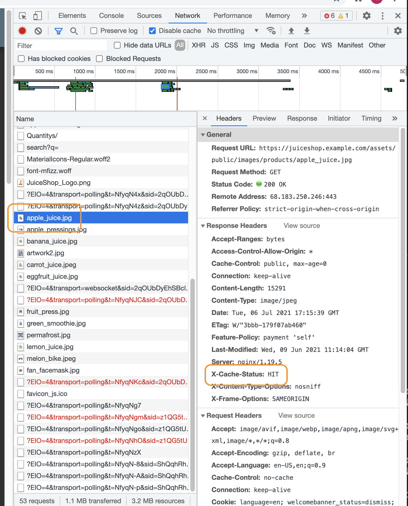

    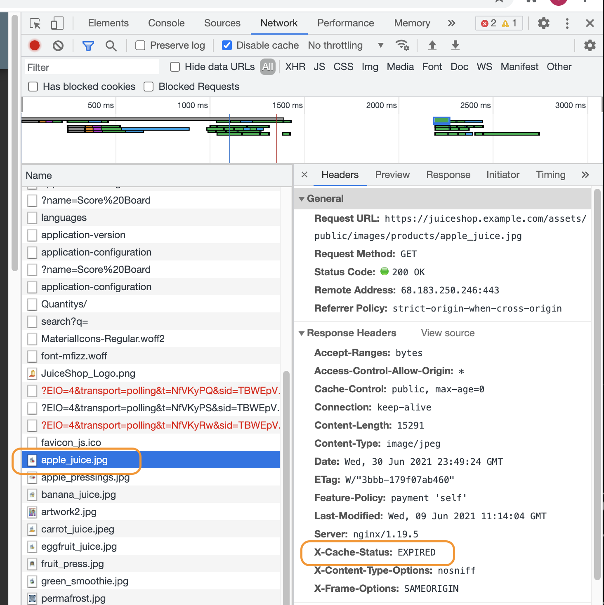

1. Check the Plus Dashboard, did you find the Cache statistics ?  You see some basic stats about Nginx Caching, the memory and disk usage, Hit Ratio, and Bytes served, changing in real-time as you browse around the Juice Shop site.  

    How high can you get your hit ratio ?

    

1. Again using Chrome Developer tools, look at the `carrot_juice.jpeg` object.  What is different ?  Why ?

    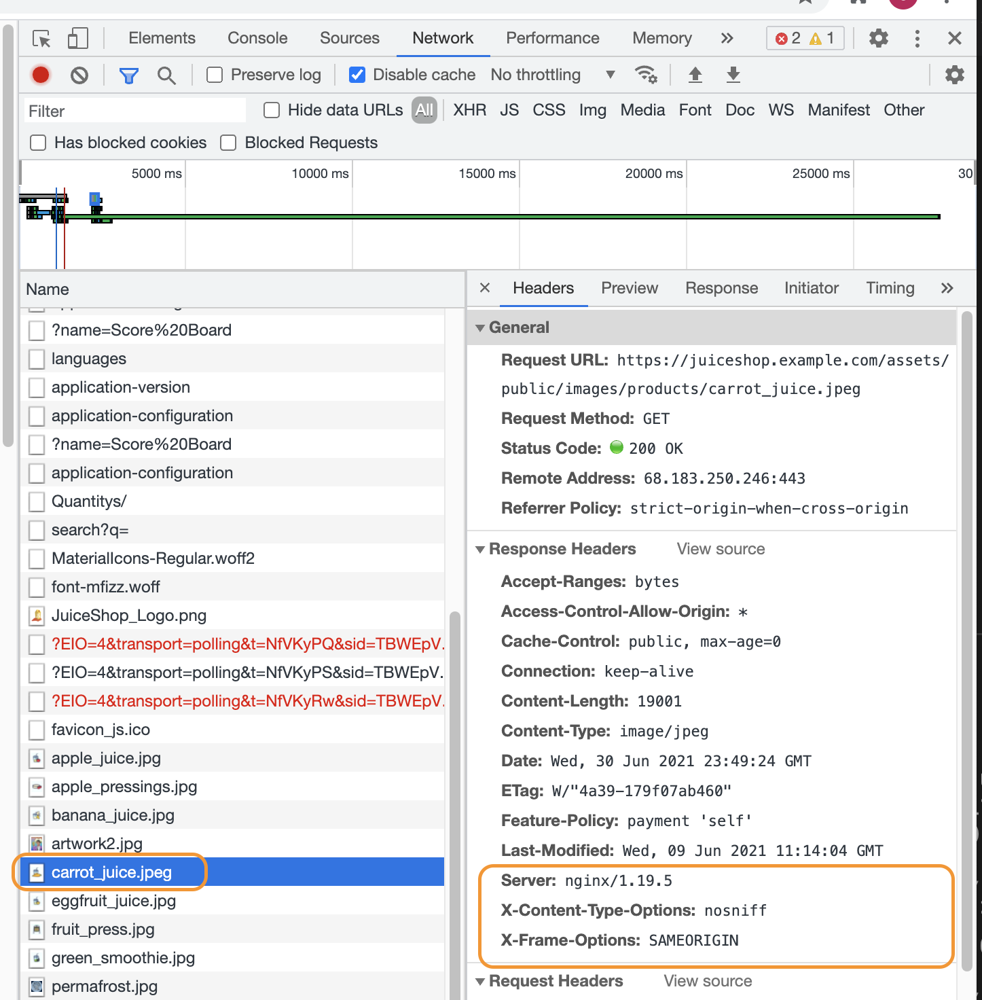


<details>
    <summary>Click for Hints!</summary>
    <br/>
    <p>
        <strong>Answer: </strong>  Nginx is not caching any HTTP objects with the ".jpeg" extension! Confirm this by looking at the YAML file, line #31.  This line is a regular expression (regex) that tells Nginx to look at the end of the URL, and match only on these object type extensions.  "JPEG is not included" in this regex. Are there other JPEG objects, for which Caching should be enabled?
    </p>

</details>

<br/>

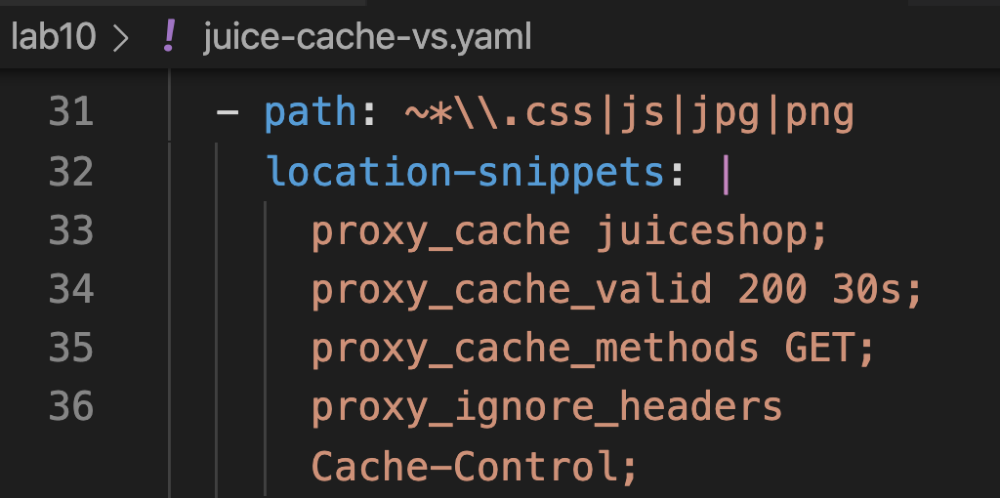

Inspect the very bottom right corner of Chrome Developer Tools...what is the difference in Page Load times, when there are Nginx Cache Hits, vs Cache Misses (refresh the page 5 or 6 times, then wait more than 30 seconds and refresh again)?  You should see the Page Load time much faster with Cache Hits, of course.  How fast could you get your page load time?

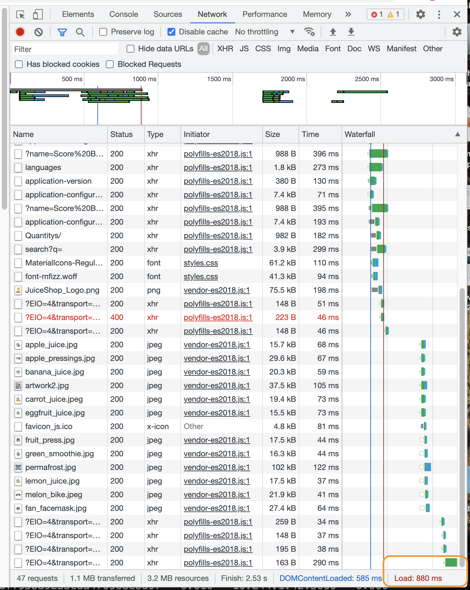

Final Check - did you notice just how much difference in response time there is, between the different JuiceShop pods ?

<br/>

>> It's important to have Advanced features like `LeastTime LastByte` load balancing, and `Caching`, to help improve the user experience with imbalanced pods that may have poor performance.


<br/>

### Mutual TLS  

<br/>


The Boss's business insurance auditor has informed him that his website must have SSL encryption for all his web traffic from end-to-end. Not just the traffic between his customers and the Ingress Controller, but also between the Ingress Controller and all of the application pods. This is called mutualTLS for the Ingress Controller. So now you have to configure/enable TLS between Ingress Controller and the Cafe coffee and tea pods, and verify that it works.

<br/>

Inspect the  `lab10/cafe-mtls.yaml`, lines 19, and 29-30.  Notice the change from port 80 to port 443 for the container and the Service, to use for mutual TLS.

|Container | Service|
|-------------------------|-------------------------|
|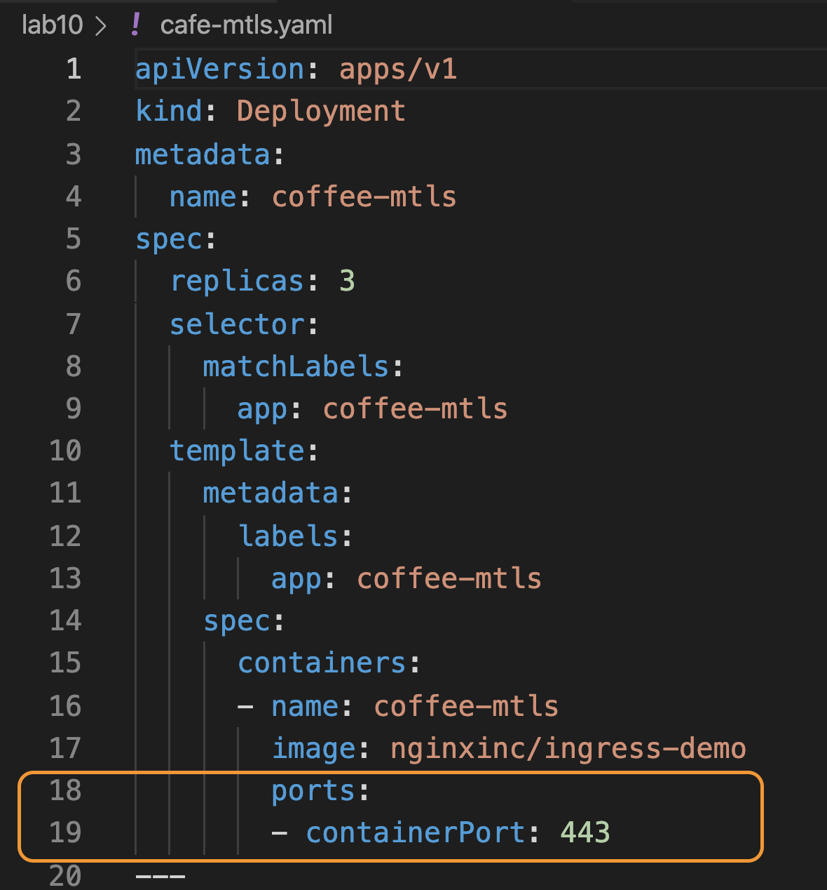 |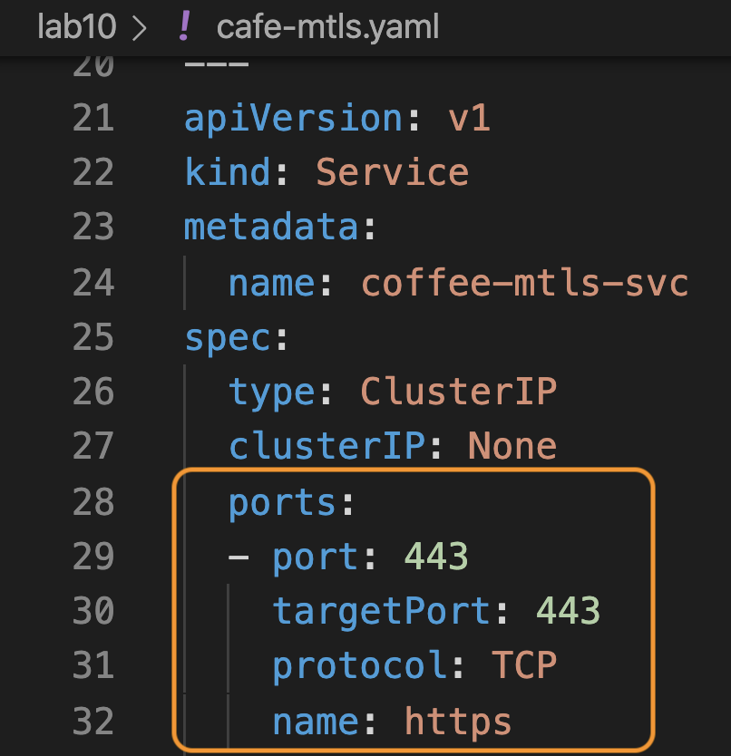|

1. First, for proper testing, you need to remove the previous Cafe virtual server, as we will still be using the cafe.example.com hostname:

    ```bash
    kubectl delete vs cafe-vs
    ```

2. Check the Plus Dashboard, the Cafe HTTP Zone should now be gone.

3. Start a fresh Cafe Demo, deploy the mTLS enabled pods and services and Virtual Server manifests:

    ```bash
    kubectl apply -f lab10/cafe-mtls.yaml
    kubectl apply -f lab10/cafe-mtls-vs.yaml
    ```

    Question - Will changing the pods from port 80 to port 443 break the previously defined Healthchecks?

    <details>
      <summary>Click for Hints!</summary>
      <br/>
      <p>
        No, it should not.  Nginx Ingress will use the pod's IP:Port definition for the Healthchecks. 
      </p>
    </details><br/>
    

4. Check the Plus Dashboard, and your new mTLS Cafe Application - ensure all 6 "mtls" coffee and tea pods are now in Up/Green status.

    

5. Using Chrome, check the access to coffee and tea as before:

    https://cafe.example.com/coffee
    
    https://cafe.example.com/tea

    Do you see the pod Server Name now shows coffee-mtls-pod-name and tea-mtls-pod-name ?

    Do you see the pod Server Address now shows port 443, and not 80 ?

    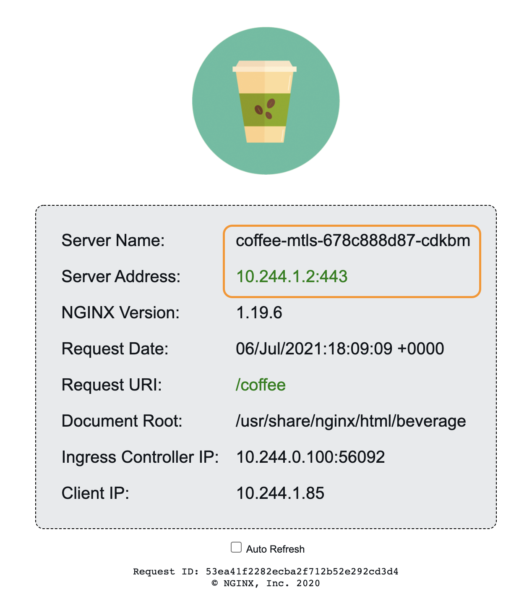

    <br/>

### Blue/Green | A/B Testing

<br/>


<br/>

During the development cycle of modern applications for Kubernetes, developers will often want to test new versions of their software, using various test tools, and ideally, a final check with live customer traffic.  There are several names for this dev/test concept - `Blue/Green deployments, A/B testing, Canary testing,` etc.  

However, switching ALL customers to new versions that might still have a few bugs in the code is quite risky.  

> Wouldn't it be nice if your Ingress Controller could split off just a small fraction of your live traffic, and route it to your new application pod for final testing?  

Nginx Plus Ingress Controller can do this, using a feature called `HTTP Split Clients.`  This feature allows you to define a percentage of traffic to be split between different k8s Services, representing different versions of your application.

You will use the currently running Cafe-mTLS coffee and tea pods, and split the traffic at an 80:20 ratio between coffee and tea Services.  

Refer to the following diagram for testing Blue/Green traffic splitting with Nginx Plus Ingress Controller:

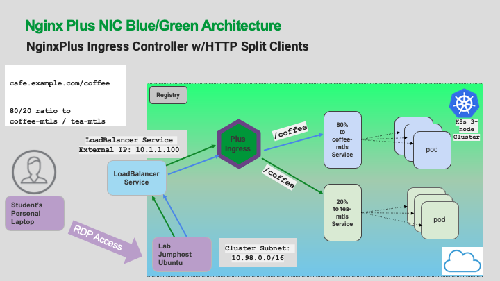

**Assume that coffee is your existing application, and tea is your new test build of the application.**  

Having read the tea leaves you are highly confident in your new code. So you decide to route 20% of your live traffic to tea. (crossing your fingers🤞)

1. First, to see the split ratio more clearly, scale down the number of coffee and tea pods to just one each:

    ```bash
    kubectl scale deployment coffee-mtls --replicas=1
    kubectl scale deployment tea-mtls --replicas=1
    ```

2. Check the Plus Dashboard, there should only be one coffee and one tea upstream now.

    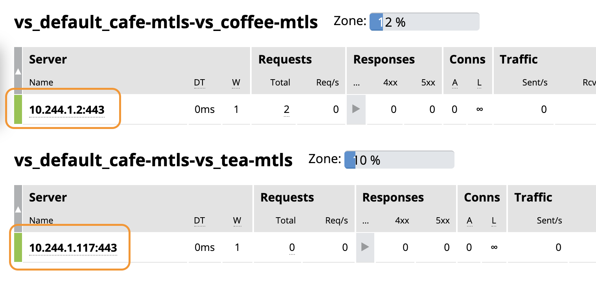

    Inspect the `lab10/cafe-bluegreen-vs.yaml` file, and note the `split and weight` directives on lines 49-56.

    

3. Next, remove the existing VirtualServer for mTLS from the previous exercise:

    ```bash
    kubectl delete -f lab10/cafe-mtls-vs.yaml
    ```

4. Now configure the Cafe Virtual Server to send 80% traffic to coffee-mtls, and 20% traffic to tea-mtls:

    ```bash
    kubectl apply -f lab10/cafe-bluegreen-vs.yaml
    ```

5. Open a Chrome tab for https://cafe.example.com/coffee, and check the Auto Refresh box at the bottom of the page.

    

    Check the statistics on the Plus Dashboard cafe-bluegreen upstreams.... Do you see approximately an 80/20 Requests ratio between coffee and tea?  You can configure the ratio in 1% increments, from 1-99%.  

    **Note:** Nginx will not load the Split configuration, if the ratio does not add up to 100%.

    

    > **Important!**   You are still using the https://cafe.example.com/coffee URL - you did not have to change the PATH of the url, but Nginx Ingress Controller is routing the requests to 2 different services, 80% to coffee-mtls AND 20% to tea-mtls!   This allows for easy testing of new application versions, without requiring DNS changes, new URLs or URIs, or other system changes.

<br/>

## References

- Active Healthchecks:  https://docs.nginx.com/nginx-ingress-controller/configuration/virtualserver-and-virtualserverroute-resources/#upstream-healthcheck

- Error Pages:  https://docs.nginx.com/nginx-ingress-controller/configuration/virtualserver-and-virtualserverroute-resources/#errorpage

- Caching:  
    
    https://docs.nginx.com/nginx-ingress-controller/configuration/global-configuration/configmap-resource/

    https://www.nginx.com/blog/nginx-caching-guide/

- Blue/Green A/B Testing:

    https://github.com/nginxinc/kubernetes-ingress/tree/master/examples-of-custom-resources/traffic-splitting

    https://www.nginx.com/blog/performing-a-b-testing-nginx-plus/

    https://www.nginx.com/blog/dynamic-a-b-testing-with-nginx-plus/

<br/>

## Workshop Wrap-Up

You have completed all the lab exercises in the workshop.  Do a final visual check on your Plus Dashboard, and check your Grafana dashboards, what do you see?  These tools should show where you finished with statistics and graphs that match your last few lab exercises. 

During the Workshop, you learned the following Nginx, Ingress, and Kubernetes topics and completed the following lab exercises:

1. Verify Nginx Ingress Controller is up and running.
1. Configure access to the NginxPlus Dashboard for monitoring real-time statistics.
1. Deploy the Café demo application for coffee/tea services.
1. Add the Bar application and Virtual Server.
1. Run a load test on your Ingress Controller and the Cafe application.
1. Scale your Cafe application, and Nginx Ingress up and down, under load without errors.
1. Change Nginx logging to help troubleshoot pod performance issues.
1. Set up and run Prometheus and Grafana with Helm, to monitor your cluster, apps and Ingress Controller.
1. Launch a new application, JuiceShop, and test it.
1. Enable some of the Advanced features of Nginx Plus, like Active Healthchecks, Caching, Sorry pages, mTLS, and Blue-Green split client testing.

-------------

<br/>

**Thank You** for your time and attention.  Please provide feedback to your Workshop hosts when asked, it is important for us to hear your feedback so we can continually improve this workshop.

**This completes this Lab.**

<br/>

> Click on Preview below for a Overview on additional workshops from NGINX !!

-------

<br/>

### Authors

- Chris Akker - Solutions Architect - Community and Alliances @ F5, Inc.
- Shouvik Dutta - Technical Solutions Architect @ F5, Inc.

-------------

Navigate to ([Preview](../preview.md) | [Main Menu](../LabGuide.md))
