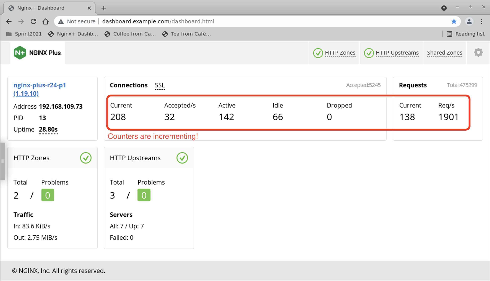
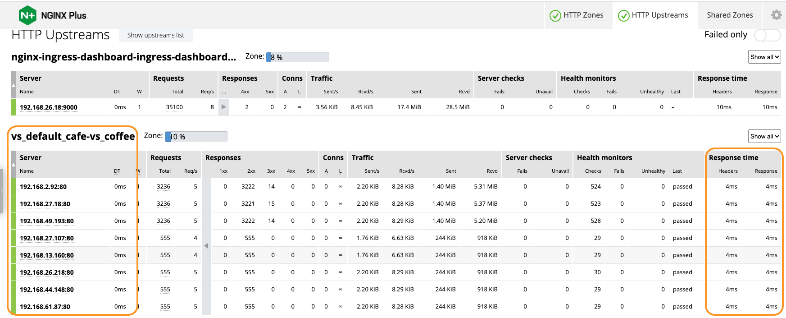
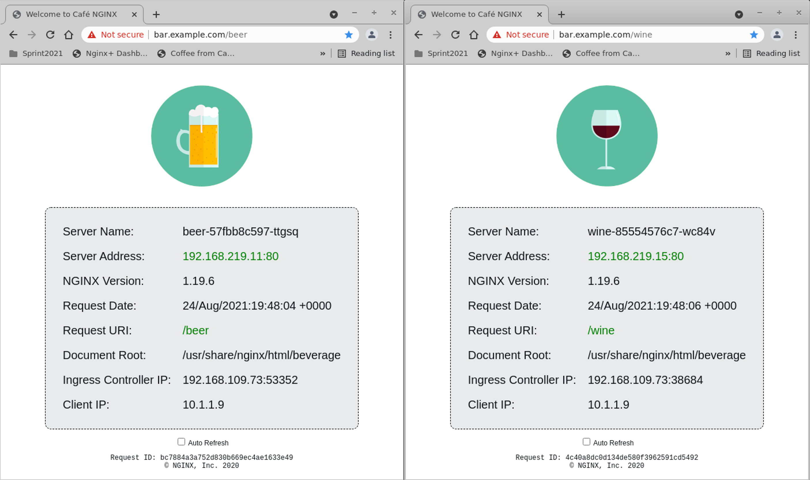
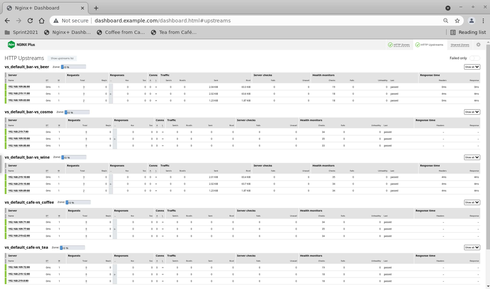

## Lab 6: HTTP Load Testing and Cafe Scaling

## Introduction

In this lab, you will send some HTTP traffic to your Ingress Controller and Cafe Application, and watch Nginx Ingress load balance the trafffic.  You will scale the application pods and Ingress Controller up and down, and watch what happens in realtime, as Nginx responds dynamically to these cluster changes.

## Learning Objectives

- HTTP Traffic Generation
- Scale Applications
- Optional Exercises
- Host-based Routing
- Observe Nginx Dashboard

## HTTP Traffic Generation

We will use a tool called [`wrk` ](https://github.com/wg/wrk) , runing in a docker container, to generate traffic to our Ingress.

1. Open a Terminal from the Ubuntu Desktop

    

1. In the terminal window, run this command to start  load generation using `wrk` inside a docker container:

    ```bash
    docker run --rm williamyeh/wrk -t4 -c200 -d20m -H 'Host: cafe.example.com' --timeout 2s https://10.1.1.10/coffee
    ```

    

    This will run the `wrk` load tool for **20 minutes**, with **200 connections**.  You can run this command again if you need additional time.

1. Observe your NGINX Plus Dashboard - http://dashboard.example.com/dashboard.html

    

    **Questions:**

     - Do you see the number of HTTP requests increasing?  
     - Do the coffee pods each take ~equal traffic?
     - What does the HTTP Zones table show?  

        <details><summary>Click for Hints!</summary>
        <br/>
        <p>
        <Strong>Hints:</Strong> Look at the Requests column, there you will find the counters for each pod. You will find traffic counters for the Host names in the HTTP Zones table.
        </p>
        </details><br/>

## Scale Applications

Coffee Break Time !! Let's scale the Coffee `Deployment`. In anticipation of a surge in coffee drinkers - The boss says we need more Keurig pods.

1. While watching the Dashboard, change the number (`replicas`) of Coffee pods from **three**, to a total of **eight**:

    ```bash
    kubectl scale deployment coffee --replicas=8
    ```
    

    How long did it take Kubernetes to add the new pods?  

    Nginx Ingress will run Active healthchecks against the pods, and then begin routing traffic to the **five** new pods. Nginx Ingress Controller automatically discovers the new pods and immediately reconfigures it's upstream groups and route traffic to them once marked healthy (Pass the health checks).

    Active healthchecks, DNS service Discovery and NGINX Plus reconfiguration API are Premium features of Nginx Plus, these features are used here, where the NGINX Ingress Controller uses the Nginx Plus API to automatically update the list Upstreams with newly discovered pods and begins to load balance them.  

    Caffiene crises averted...

    

1. Inspect the NGINX Plus Dashboard. Look at the far right column of the `HTTP Upstreams` view and you see `HTTP Header` and `Response times` values in milliseconds.  

   Nginx Plus tracks the actual response time of the pods, when it receives the HTTP header, and when it receives the entire response body.  Wouldn't it be nice if you could actually send more requests to the pods responding the fastest?  With NGINX Plus, you can do just that.

1. Let's configure NGINX Ingress Controller to use a NGINX Plus Load Balancing algorithm called `Least-Time Last-Byte`  so that the most responsive (faster) pods are prioritized for more HTTP Requests. Apply the following manifest:

    ```bash
    kubectl apply -f lab6/nginx-config-lastbyte.yaml
    ```

    - **Question:** Why are some pods faster or slower than others?
    <details>
      <summary>Click for Hints!</summary>
      <br/>
      <p>
        <strong>Answer:</strong>  In case you didn't find it, <code>HTTP Response Time</code> is on the far right column of the Dashboard in <code>HTTP Upstreams</code>.</br></br> Some pods are slower than others, because there are other workloads running in the cluster, and you don't control where and when those other workloads are deployed, or how many resources they will consume among the pods.</br></br>This means not all pods are equal, leading to an imbalance of Response Times. <br/></br>Some users will connect to a fast pod, some will get stuck with a slow pod.
      </p>
    </details><br/>

1. After changing the algorithm, now look at the Dashboard `HTTP Upstream` metrics, you should see the **faster** pods taking more requests than the slower pods. 

    **Note:** Faster means lower `Response Time` in milliseconds.
   
   This is an important NGINX Plus feature. NGINX tracks each `pod`'s response time, and distributes more traffic to faster pods in the cluster.  

    In today's Digital Experience production workloads, it is important to send customers' requests to the most reliable and performant `pod` (server).  NGINX Plus's `LeastTime - LastByte` Load Balancing algorithm allows you to handle more total requests, and, it adjusts automatically as pod performance and conditions in the Kubernetes cluster change minute by minute. 
    
    **This yields a better customer experience, essential for today's modern digital experience workloads.** 

    **NOTE**: the Response time differential must be `> 20ms` between the pods, for NGINX to consider some pods faster than others. 

1. Boss says Coffee rush is now over, so scale back the number of coffee pods to **three**. Run the following `kubectl scale ` command:

    ```bash
    kubectl scale deployment coffee --replicas=3
    ```

    Did you notice any errors in the NGINX Plus Dashboard while Kubernetes scaled up/down the pods? 

    

    When scaling down, NGINX will complete workloads before Kubernetes terminates a running `pod`, after all the responses in flight have finished processing on that` pod`, so there should not be any errors. When scaling up, NGINX also healthchecks new pods before sending any requests to them, to make sure they are ready to take requests.

    Did you notice any errors when you asked NGINX to change its load balancing algorithm from round-robin to `Least-time Last-byte`? There should not have been any errors. The Dynamic Configuration Reload feature allows existing connections to finish their work, while allowing new connections to use the new configuration. 
    
    > This results in **no dropped connections during configuration changes.**

### Optional Lab Exercise1: 

Try the same scale up, then scale down commands for the Cafe **Tea** `Deployment`. Does NGINX also send more traffic to the faster Tea pods? Set the tea pods back to **three** replicas when you are finished.

**Note:**  You will have to target `/tea` with the `wrk` tool if you want to load test Tea:

1. Run the following command to apply load to the Tea Service:

    ```bash
    docker run --rm williamyeh/wrk -t4 -c200 -d15m -H 'Host: cafe.example.com' --timeout 2s https://10.1.1.10/tea
    ```

### Optional Lab Exercise2: 

1. You can change the load balancing algorithm back to round-robin if you like, and check out the differences. Apply the following manifest to make that change:

    ```bash
    kubectl apply -f lab6/nginx-config-roundrobin.yaml
    ```

## Host Based Routing

**New business opportunity**: The boss got a business loan to open the Cafe as a Bar in the evening for beer and wine tasting! So you need to add Beer and Wine applications, and expose these using the NGINX Ingress Controller. 

**Hurry up - it's almost Happy Hour!**

See the topological view of the new **beer** and **wine** applications


1. In the `lab6` folder, inspect the `bar.yaml` and `bar-virtualserver.yaml` manifest files. You will see that we are adding the required ` Deployment` and `Service`, and exposing them with `VirtualServer`, using a new hostname, `bar.example.com.`

    

1. Create the **beer** and **wine** ` Deployment` and `Service`, by applying the provided manifests. 
   
    ```bash
    kubectl apply -f lab6/bar.yaml
    ```

1. Create a new `VirtualServer` listening on the hostname, **`bar.example.com`**, with `/beer` and `/wine` URI paths to the new application deployments, by applying the `bar-virtualserver.yaml` file:
   ```bash
   kubectl apply -f lab6/bar-virtualserver.yaml
   ```

1. Open two new Chrome web browser windows and browse to
   https://bar.example.com/beer and https://bar.example.com/wine.  
   
   **Note:** You can once again safely proceed to this insecure site.

   Do the new `beer` and `wine` applications load as expected?

   

1. Observe your KIC Plus Dashboard again on http://dashboard.example.com/dashboard.html

    **Questions:**

    - What does the Dashboard show you when you refresh `/beer` and `/wine` multiple times?  
    - Did you find your new `HTTP upstreams` for **beer** and **wine**?  
    - What did you find in the `HTTP Zones` table?

      

      

    You can see how easy it is to add new `Deployment` and `Service`, and then configure NGINX Plus Ingress Controller to create a new HTTP Host route, URI paths and route traffic to these new services and have access to these applications immediately. The NGINX Plus `VirtualServer` CRD's allow you to easily add new hosts and services.

    This ability of self-service Host and Path based HTTP routing makes it easy to add and deploy new services, and NGINX Plus Ingress routes the traffic correctly **(and BTW - you didn't have to submit even one Ticket to IT and WAIT !!)**. 
    
    As you can see, this enables application/development teams to rapidly build, deploy, and expose new digital services for the business, without waiting for lengthy deployment/approval processes.

**Bonus:** `Sneaky Pete!`  There was one additional `Happy Hour Drink Special` cocktail added by the boss's daughter.  Did you find it? 

  <details>
    <summary>Click for Answer!</summary>
    <br/>
    <p>
      <strong>Answer:</strong> In case you did't find it, the boss's daughter added <code>/cosmo</code> to the beer and wine manifests!  Does <code>https://bar.example.com/cosmo</code> work as intended ?
    </p>
  </details><br/>

You should also notice that Cafe is still running as before, adding the Bar services and VirtualServer definitions had no impact.

**This completes this Lab.**

## References: 
- [Least_time Algorithm](http://nginx.org/en/docs/http/ngx_http_upstream_module.html#least_time)
- [Random Algorithm](http://nginx.org/en/docs/http/ngx_http_upstream_module.html#random)
- [Dyanamic Reconfiguration with NGINX
  Plus](https://www.nginx.com/blog/dynamic-reconfiguration-with-nginx-plus/)
- [Wrk Tool](https://github.com/wg/wrk)

### Authors
- Chris Akker - Solutions Architect - Community and Alliances @ F5, Inc.
- Shouvik Dutta - Technical Solutions Architect @ F5, Inc.

-------------

Navigate to ([Lab7](../lab7/readme.md) | [Main Menu](../LabGuide.md))
